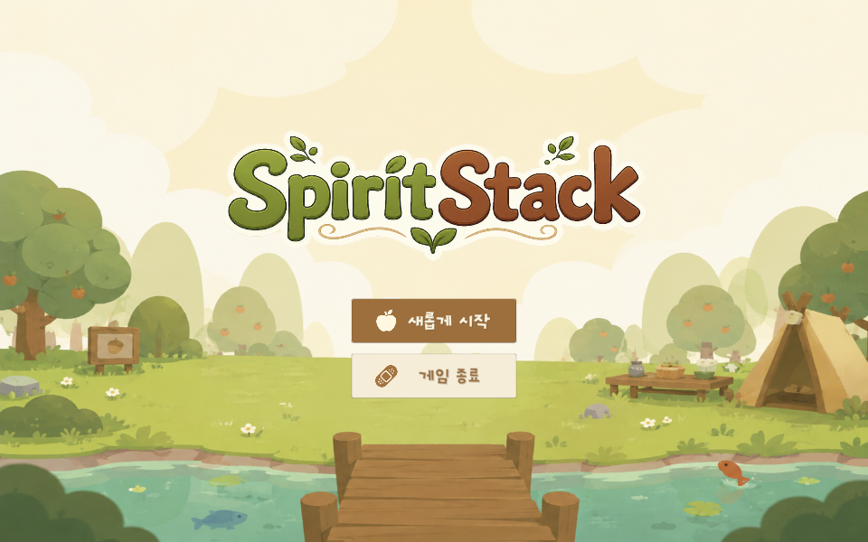
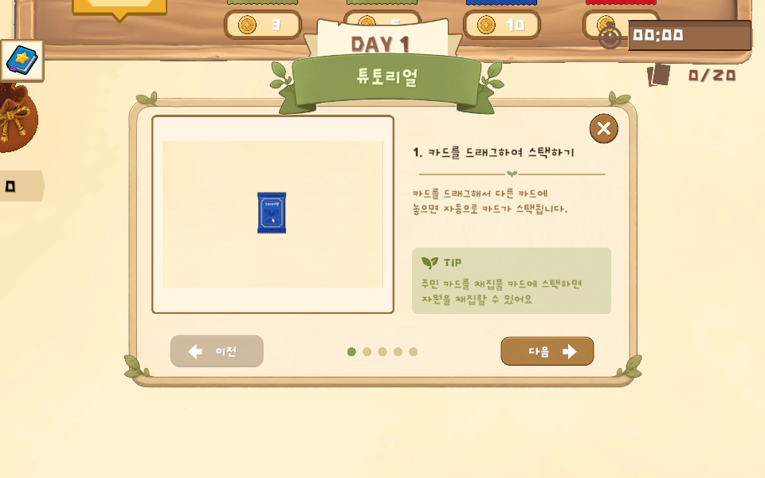
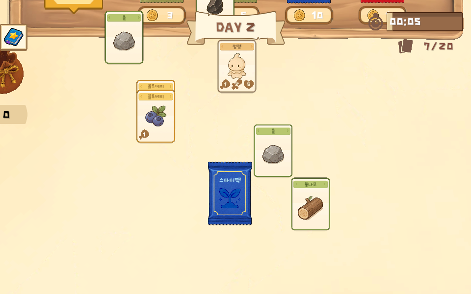
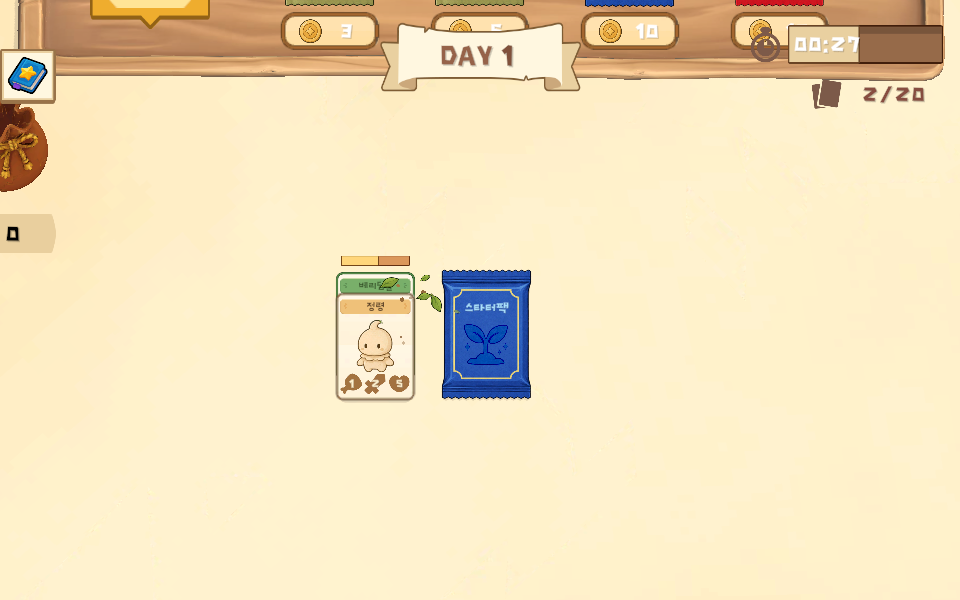
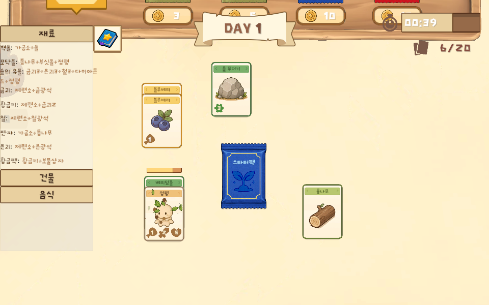
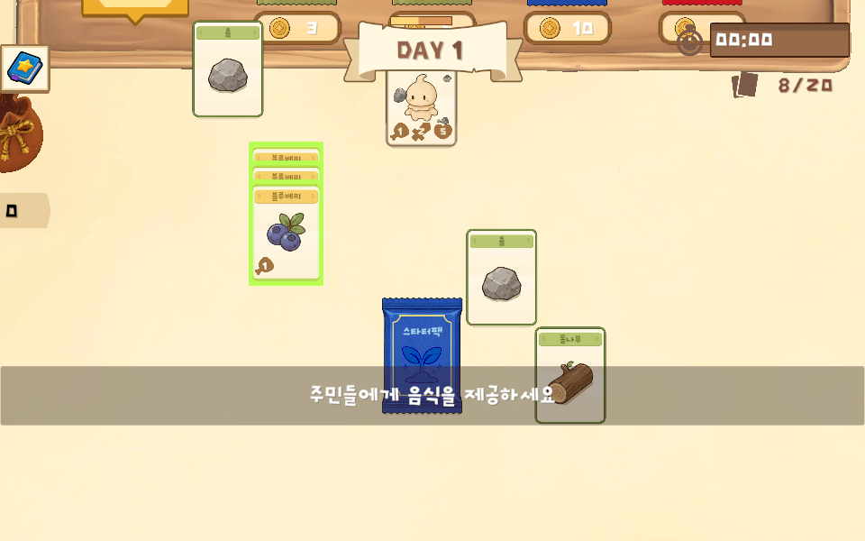
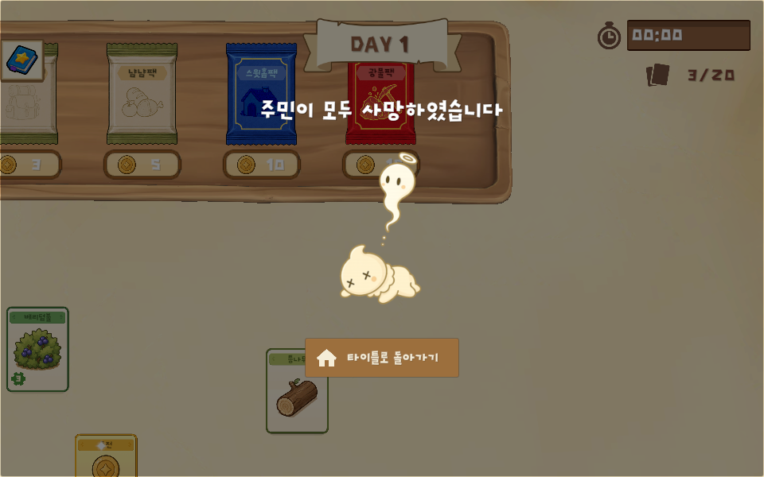

# SpiritStack

> 카드를 쌓아 마을을 키우는 생존 경영 시뮬레이션

<p align="center">
  
</p>

---

## 프로젝트 개요

| 항목 | 내용 |
| --- | --- |
| 프로젝트명 | **SpiritStack** (Unity 프로젝트 폴더명은 초기 명칭인 `JellyStack`) |
| 장르 | 카드 스태킹 생존 경영 시뮬레이션 |
| 플랫폼 | PC (Windows Standalone) · WebGL |
| 엔진 | Unity **6000.3.15f1** (URP) |
| 개발 인원 | 1인 (김지해) |
| 개발 기간 | 2026. 05. 18 ~ 06. 08 (약 3주) |
| 현재 빌드 | 1.0.3 |
| 레퍼런스 | *Stacklands* (Sokpop Collective, 2022) |

### 이 프로젝트를 만든 이유

레퍼런스로 삼은 **Stacklands**는 복잡한 조작 없이 카드를 쌓는 것만으로 플레이가 진행되는
편안한 몰입감, 수많은 조합을 발견하는 수집의 재미, 낮은 진입장벽이 강점인 게임입니다.
SpiritStack은 이 핵심 재미(카드 스태킹 · 조합 · 생존 사이클)를 직접 구현해 보고,
여기에 **날씨 · 주민 속성 · 세계수 드롭 · 레시피별 이펙트**라는 차별 요소를 더해 확장한 프로젝트입니다.

### 개발 일정

| 주차 | 기간 | 목표 | 주요 작업 |
| --- | --- | --- | --- |
| WEEK 1 | 05.18 ~ 05.24 | 코어 시스템 구축 | 카드 데이터 구조 · PlayerInput 입력 · 카메라 줌/이동 · 레시피 조합 · 채집 · 자동 스택 · 스타터 카드팩 · 하루 사이클 · 식량/게임오버 |
| WEEK 2 | 05.25 ~ 05.31 | 시스템 확장 | 판매·상점 시스템 · 카드팩 확률 · 적 스폰/전투 · 주민 속성 시스템 · 날씨 시스템(4종) |
| WEEK 3 | 06.01 ~ 06.08 | 콘텐츠 · 완성도 | 타이틀 씬 · 카드 최대 개수/창고 확장 · 세이브/로드 · 레시피별 이펙트 · 사운드 · UI 작업 |

---

## 게임 소개

**주민(정령) 카드를 중심으로 자원을 모으고, 제작하고, 마을을 지켜내는 생존 경영 게임**입니다.
카드를 쌓아 작업을 지시하고 · 하루가 지날 때마다 식량으로 주민을 먹이며 · 적의 습격과 변화하는 날씨를 버텨냅니다.

### 핵심 게임 루프

```
 카드 스택  →  채집 · 제작  →  하루 경과  →  적 웨이브  →  경제 순환
    │             │              │            │             │
 주민 + 자원   레시피에 따라   2분 = 하루   포탈에서 적    카드 판매 → 코인
 카드를 겹쳐   자원 채집 ·    매일 주민이   출현, 주민과   → 카드팩 구매로
 작업 시작     음식/도구 생산  식량을 소비   자동 전투      마을 확장
```

매일 반복되는 사이클 속에서 **식량 · 전투 · 날씨**를 관리하며 더 오래 생존하는 것이 목표입니다.

### 주요 시스템 (구현 범위)

- **카드 스택 & 자동 스택** — 드래그·겹침으로 상호작용, 인접한 동종 카드는 자동 정렬
- **레시피 · 제작 시스템** — 재료 조합 → 음식 · 도구 · 건물 생산
- **채집 & 랜덤 보상** — 자원 채집과 확률형 드롭
- **하루 사이클 & 식량** — 2분 = 하루, 하루가 끝나면 식량 배급 페이즈 → 부족하면 주민 사망
- **정산(카드 한도)** — 기본 20장 한도, 초과 시 판매해 줄여야 다음 날 시작 (창고 1개당 +5장)
- **상점 & 코인 경제** — 구매/판매 거점, 코인 주머니
- **적 웨이브 & 전투** — 포탈 출현, 자동 전투와 드롭, 보스 처치 시 엔딩
- **날씨 시스템** — 룰렛 기반 4종 날씨 효과
- **세이브 / 로드** — 전체 게임 상태(날짜 · 날씨 · 모든 스택과 카드 상태) 저장 및 복원

### 레퍼런스와의 차별점

<details open>
<summary><b>① 날씨 시스템</b> — 7일마다 룰렛을 돌려 날씨를 정하고 3일간 효과가 지속</summary>

| 날씨 | 효과 |
| --- | --- |
| ☀️ 맑음 (Sunny) | 채집 결과가 30% 확률로 2배 |
| 🌧️ 비 (Rain) | 채집 속도 1.5배 가속 |
| ❄️ 눈 (Snow) | 매일 카드 2장이 빙결되어 사용 불가 |
| 🌪️ 폭풍 (Storm) | 랜덤 3장이 흔들리고, 매일 1장씩 날아감 |

</details>


<details open>
<summary><b>③ 세계수 랜덤 드롭 시스템</b> — 필드에 랜덤 생성되는 5회 채집 가능한 나무</summary>

세계수를 채집할 때마다 **통나무 / 요정허브**가 무작위로 드롭되고,
요정허브로 **요정 스프**(음식 카드)를 만들 수 있습니다.
음식 카드의 종류가 부족했던 상황에서 새로운 음식 공급원이자 즐길 거리를 제공하기 위해 추가한 콘텐츠입니다.

</details>

<details open>
<summary><b>④ 레시피별 이펙트 연출</b> — 작업 종류에 맞는 전용 파티클</summary>

레시피·채집 데이터마다 `effectPrefab`을 지정해 두고, `ProgressTask`가 작업 중 해당 이펙트를 카드 위에 생성합니다.
나무 채집은 나무 조각이 흩뿌려지고, 돌 캐기는 돌 조각이 튀어 오르는 식으로 **무슨 작업 중인지 한눈에** 보입니다.
(진행 바만 멍하니 바라보던 레퍼런스 게임의 아쉬움을 보완한 부분입니다.)

| 돌 캐기 | 회복(하트) |
| --- | --- |
|  |  |

</details>

---

## 스크린샷

| 타이틀 화면 | 튜토리얼 |
| --- | --- |
|  |  |

| 인게임 보드 | 카드 스택으로 채집 |
| --- | --- |
|  |  |

| 레시피 북 | 식량 배급 페이즈 |
| --- | --- |
|  |  |

| 게임 오버 |
| --- |
|  |

> 스크린샷은 `Build_1.0.3_Web` (WebGL 빌드)에서 촬영했습니다.

---

## 실행 방법

### 빌드 실행

- **Windows** — `JellyStack/Build_1.0.3/SpiritStack.exe` 실행
- **WebGL** — `JellyStack/Build_1.0.3_Web/`은 정적 웹 서버가 필요합니다.
  `.data`/`.wasm`/`.framework.js` 파일이 gzip으로 압축되어 있으므로,
  서버가 `Content-Encoding: gzip` 헤더를 내려주도록 설정한 뒤 `index.html`을 열어주세요.

### 에디터에서 실행

1. Unity **6000.3.15f1** 로 `JellyStack/` 폴더를 엽니다.
2. `Assets/Scenes/Title.unity` 를 열고 재생합니다. (인게임 씬은 `Assets/Scenes/Ingame.unity`)

조작은 마우스만 사용합니다 — **카드 드래그**로 스택/이동, **빈 공간 드래그**로 카메라 이동, **휠**로 줌, **ESC**로 일시정지.

---

## 기술 스택 · 구조

### 사용 기술

- Unity 6000.3.15f1 · Universal Render Pipeline
- Input System (PlayerInput · Invoke Unity Events)
- DOTween (카드 이동 · 룰렛 · 연출 트윈)
- TextMesh Pro
- Firebase Auth · Realtime Database (이메일 로그인 및 세이브 데이터 클라우드 동기화)

### 핵심 설계

**1. ScriptableObject 데이터 기반 설계**
카드 · 레시피 · 카드팩 · 적 스포너 같은 게임 내용을 코드가 아닌 데이터 에셋으로 분리했습니다.
코드를 건드리지 않고 수치·확률을 조정할 수 있어 밸런싱이 쉽고, 새 카드를 추가해도 기존 코드를 거의 수정할 필요가 없습니다.

**2. 카드 고유 스택 관리 시스템 (`CardStack`)**
쌓인 카드를 한 묶음으로 관리하며 자동으로 정렬합니다.
카드를 내려놓으면 가까운 스택에 자동으로 합쳐지고, 주민은 항상 맨 위에 놓이며, 적·빙결 카드는 합쳐지지 않는 규칙을 가집니다.

### 프로젝트 구조

```
JellyStack/Assets/
├── Script/
│   ├── Manager/     # GameManager, DayManager, WeatherManager, RecipeManager,
│   │                #  EnemyManager, FeedManager, SettlementManager,
│   │                #  InputManager, UIManager, SoundManager, FirebaseManager
│   ├── Data/        # ScriptableObject 정의 (CardData, VillagerCardData,
│   │                #  EnemyCardData, CardRecipe, WeatherType ...)
│   ├── Card/        # Card, CardStack, VillagerCard, EnemyCard, FoodCard, 카드 UI
│   ├── CardPack/    # 카드팩 데이터 · 확률 · 개봉 처리
│   ├── Battle/      # BattleManager, BattlePoint (자동 전투)
│   ├── Shop/        # BuyPoint, SellPoint, CoinPoket
│   ├── Save/        # SaveManager, SaveSystem, SaveData, CardDatabase
│   └── UI/          # 인게임 HUD, 레시피북, 일시정지, 로그인/회원가입, 엔딩 창
├── Data/            # 카드 · 레시피 · 카드팩 ScriptableObject 에셋
├── 1.Prefab/        # 카드 · 카드팩 · 전투 · 이펙트 프리팹
├── Scenes/          # Title.unity, Ingame.unity
└── Sprite / Sound / Particle / Animation / 3D_Resource
```

세이브 데이터는 로컬(`Application.persistentDataPath/savegame.json`)에 저장되며,
로그인한 경우 Firebase Realtime Database에도 함께 동기화됩니다.

---

<p align="center">
  <sub>SpiritStack · 카드 스태킹 생존 경영 게임 · Build 1.0.3 · 김지해</sub>
</p>
